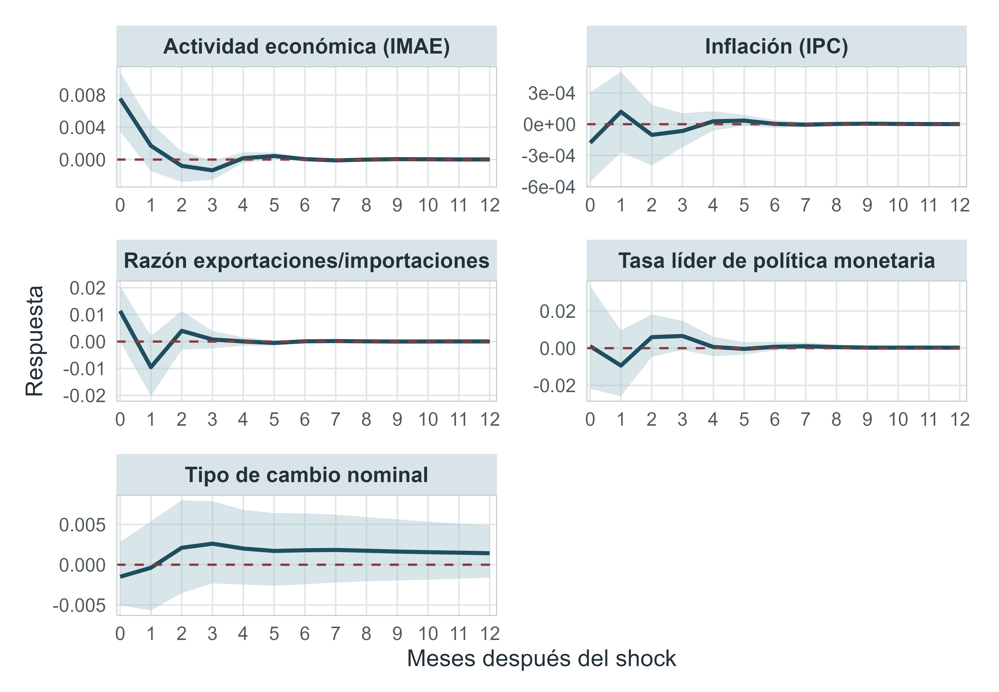

```{=typst}
#show figure.caption.where(kind: "quarto-float-tbl"): it => block(width: 100%)[
  #align(center)[
    #text[
      #it.supplement #context it.counter.display(it.numbering)
    ]
    #linebreak()
    #emph(it.body)
  ]
]
```

```{=typst}
#show figure.caption: it => [
  #stack(
    dir: ttb,
    spacing: 0.8em,

    [#align(center)[
      #strong[
        #it.supplement #context it.counter.display(it.numbering)
      ]
    ]],

    [#align(center)[
      #it.body
    ]],
  )
]

#let apa-figure(
  path,
  title,
  fig_label,
  note: none,
  width: 100%,
) = [
  #figure(
    [
      #align(center)[
        #image(path, width: width)
      ]

      #if note != none [
        #v(0.35em)

        #align(left)[#text(size: 12pt, weight: "regular", font: "Times New Roman")[
          #emph[Nota.] #note
        ]]
      ]
    ],
    caption: figure.caption(
      position: top,
      title,
    ),
    supplement: [Figura],
    kind: image,
  )
  #label(fig_label)
]
```




# Marco Referencial

## Antecedentes
La literatura macroeconómica internacional ha documentado ampliamente cómo se transmiten shocks en economías avanzadas hacia economías emergentes dado que estas perturbaciones pueden tener implicaciones en la estabilidad y el crecimiento de estas economías pequeñas y abiertas. Principalmente se ha estudiado la relevancia de identificar los canales por los cuales se propagan estos efectos incluyendo redes de producción, comercio y mercados financieros. Respecto a este último, @Dornbusch2000Contagion sostienen que debido al desarrollo y la integración de mercados de capitales el canal financiero se ha convertido en la vía con mayor impacto y velocidad de propagación.

A nivel empírico, un enfoque común ha sido el uso de modelos vectores autorregresivos VAR para identificar y cuantificar el impacto de distintos tipos de shocks sobre variables macroeconómicas, dentro y entre países. En este marco el estudio de @Canova2005The sirve de referencia clave para América Latina, mostrando como shocks monetarios de Estados Unidos sí tienen efectos significativos sobre las economías latinoamericanas, mientras que shocks reales de demanda y de oferta tienen efectos reducidos o estadísticamente no significativos, un hallazgo consistente con la importancia del canal financiero que menciona @Dornbusch2000Contagion

Adicionalmente, @Canova2005The encuentra que el canal financiero, particularmente a través de tasas de interés y flujos de capital, es el principal mecanismo de transmisión de estos shocks, superando en relevancia al canal comercial. Asimismo, el estudio evidencia que una proporción importante de la volatilidad macroeconómica en América Latina puede explicarse por perturbaciones externas, lo que sugiere la existencia de un componente común en los ciclos económicos de la región. Estos hallazgos son consistentes con la evidencia teórica sobre la creciente importancia de la integración financiera internacional y refuerzan la necesidad de considerar factores externos en el análisis macroeconómico de economías emergentes.

Los shocks que afectan a la economía de Estados Unidos también tienen efectos relevantes sobre la economía guatemalteca debido a la estrecha interdependencia ambos países, manifestándose principalmente a través del comercio y de manera creciente, mediante el flujo de remesas, el cual|ha adquirido una importancia significativa en la estructura macroeconómica del país principalmente en los últimos años. En particular, las remesas representan una fuente importante de ingresos externos para los hogares y una proporción considerable en del PIB. A cuenta de eso, @CastanedaFuentes2018Emigrant señalan el aumento sostenido de las remesas puede generar una apreciación del tipo de cambio real, mediante un incremento de la demanda interna, particularmente de bienes no transables, lo que produce un desplazamiento de recursos del sector transable al no transable lo que elevaría los precios relativos.

## Marco Contextual
La economía guatemalteca se inserta en un entorno internacional caracterizado por una elevada interdependencia macroeconómica, en el cual las perturbaciones originadas en economías avanzadas pueden transmitirse hacia economías pequeñas y abiertas mediante distintos canales, en ese contexto, la literatura para América Latina y otras economías emergentes ha mostrado que los shocks de Estados Unidos pueden afectar el producto, la inflación, las tasas de interés y las condiciones externas de los países receptores. En particular, Canova (2005) encuentra que los shocks de Estados Unidos explican una porción importante de la variabilidad macroeconómica en América Latina y que los shocks monetarios tienen efectos más significativos que los shocks reales, con predominio del canal financiero. De forma complementaria, @DeSimone2024The muestra que en pequeñas economías abiertas la política monetaria de Estados Unidos incide de manera importante sobre la actividad económica, la inflación y las tasas de interés, en un contexto donde los canales financieros adquieren creciente relevancia.

En este contexto general, Guatemala presenta características que hacen especialmente relevante el estudio de la transmisión de shocks externos. Se trata de una economía pequeña y abierta, estrechamente vinculada a Estados Unidos no solo por el comercio exterior, sino también por el flujo de remesas y la disponibilidad de divisas, factores que condicionan su desempeño macroeconómico. Esta relación estructural implica que variaciones en la demanda agregada estadounidense pueden reflejarse en cambios en las exportaciones guatemaltecas, en el ingreso de los migrantes y, por esa vía, en los flujos de remesas, así como en presiones sobre el mercado cambiario y las reservas internacionales.

El canal de remesas resulta particularmente importante para el caso guatemalteco. @CastanedaFuentes2018Emigrant muestran que las remesas han aumentado de manera sustancial como proporción del PIB y que este proceso ha coincidido con una apreciación del tipo de cambio real. En esa investigación mediante un modelo DSGE calibrado para Guatemala, encuentran que un incremento sostenido de remesas puede generar una apreciación del tipo de cambio real, una contracción del sector transable y una expansión del sector no transable, lo que sugiere que en Guatemala las remesas no son solo una fuente de ingreso para los hogares, sino también un mecanismo macroeconómico de transmisión de shocks externos.

El contraste de la literatura previa muestra diferencias importantes en enfoques, metodologías y resultados. @Canova2005The emplea un VAR estructural para un conjunto de países latinoamericanos y se concentra en distinguir distintos tipos de shocks externos y sus efectos promedio sobre la región. @DeSimone2024The utiliza un SFAVAR con una base amplia de datos para pequeñas economías abiertas y enfatiza la relevancia de los canales financieros y del ciclo financiero global. Por su parte, @CastanedaFuentes2018Emigrant desarrollan un DSGE calibrado para Guatemala, enfocado específicamente en el canal de remesas y su impacto sobre el tipo de cambio real y la estructura sectorial. Estos estudios aportan elementos fundamentales, pero aún dejan un vacío en el cual no se ha integrado el caso guatemalteco considerando simultáneamente exportaciones, remesas e inflación.

## Marco Teórico

La presente investigación se sustenta en la teoría de la macroeconomía abierta, la cual establece que las economías pequeñas y abiertas se encuentran expuestas a perturbaciones originadas en el entorno internacional. En este marco, los shocks provenientes de economías grandes pueden transmitirse a través de distintos canales, afectando variables internas como el producto, la inflación, el sector externo y las condiciones financieras. Esta idea parte del concepto de interdependencia macroeconómica internacional, según el cual la creciente integración comercial y financiera amplifica la sensibilidad de las economías emergentes frente a cambios en las condiciones externas.

Desde el punto de vista teórico, los modelos de economía abierta, especialmente la tradición de Mundell-Fleming, ofrecen una base conceptual para entender cómo se propagan estos shocks. En una economía pequeña y abierta, cambios en el ingreso externo, en la demanda por exportaciones o en las tasas de interés internacionales pueden modificar la absorción interna, el equilibrio externo y los precios relativos. En esta línea, @DeSimone2024The sostiene que, bajo apertura comercial y movilidad de capital, las perturbaciones originadas en Estados Unidos pueden transmitirse mediante canales de absorción, tipo de cambio y condiciones financieras, con efectos relevantes sobre la actividad y la inflación en economías pequeñas y abiertas.

Sin embargo, la literatura regional no puede trasladarse automáticamente al caso guatemalteco. Guatemala comparte con otras economías emergentes su condición de economía pequeña y abierta, pero presenta características particulares que hacen necesario un análisis específico. Entre ellas destacan su estrecha vinculación con Estados Unidos, tanto por comercio como por migración, así como la elevada importancia de las remesas dentro de su estructura macroeconómica. En este sentido, la transmisión de shocks externos no solo puede operar por la vía comercial o financiera tradicional, sino también a través del ingreso de remesas.

Este último canal ha sido estudiado para Guatemala por @CastanedaFuentes2018Emigrant, quienes desarrollan un modelo DSGE y muestran que un aumento sostenido de remesas puede apreciar el tipo de cambio real, reducir la competitividad externa y desplazar recursos desde el sector transable hacia el sector no transable, en una dinámica similar a la enfermedad holandesa, “duch disease”. Los autores encuentran además que la trayectoria observada de la economía guatemalteca es más consistente con un aumento percibido como permanente en las remesas, lo cual refuerza la relevancia macroeconómica de este canal.

A pesar de estos avances, persiste un vacío en la literatura, primero porque la evidencia para América Latina se concentrado en el efecto promedio de shocks externos, sin incluir la especificidad del caso guatemalteco, y segundo que la literatura para Guatemala ha enfatizado el vínculo entre remesas y tipo de cambio real, pero no se ha integrado este canal dentro de un análisis dinámico de transmisión de shocks de demanda originados en Estados Unidos. En este contexto, la presente tesis busca aportar a la literatura al estudiar cómo se transmiten los shocks de demanda agregada de Estados Unidos hacia la economía guatemalteca, identificando su efecto dinámico sobre exportaciones, remesas, inflación y reservas internacionales mediante un modelo VAR.

# Planteamiento del Problema

## Pregunta de Investigación

¿Cuál es la magnitud, dirección y persistencia de la respuesta del Índice Mensual de la Actividad Económica, la inflación, la razón de exportaciones a importaciones, la tasa líder de política monetaria y el tipo de cambio nominal de Guatemala ante choques estructurales de oferta, demanda y política monetaria identificados dentro del bloque macroeconómico de Estados Unidos durante el período 2010–2025?


## Objetivos

### Objetivo General
Estimar, mediante un modelo VAR por bloques con identificación estructural, la magnitud, dirección y persistencia de la respuesta de la actividad económica, la inflación y las variables comerciales, monetarias y cambiarias de Guatemala ante choques de demanda, oferta y política monetaria originados en Estados Unidos durante el período 2010–2025.


### Objetivos Específicos

1. Especificar y estimar un modelo VAR estructural por bloques que incorpore las variables macroeconómicas de Estados Unidos y Guatemala, imponiendo la exogeneidad del bloque estadounidense respecto de la economía guatemalteca.

2. Identificar, dentro del bloque macroeconómico de Estados Unidos, choques estructurales de oferta, demanda y política monetaria mediante descomposición de Cholesky fundamentado en la teoría económica.

3. Estimar la respuesta dinámica del Índice Mensual de la Actividad Económica y de la inflación de Guatemala ante cada tipo de choque estructural estadounidense.

4. Estimar la respuesta de la razón de exportaciones a importaciones, la tasa líder de política monetaria y el tipo de cambio nominal de Guatemala ante los choques identificados en el bloque estadounidense.

5. Comparar la dirección, la magnitud máxima, el efecto acumulado y la persistencia de las respuestas de las variables guatemaltecas ante los choques de oferta, demanda y política monetaria.

6. Determinar la importancia relativa de cada choque estadounidense en la variabilidad de las variables macroeconómicas de Guatemala mediante la descomposición de la varianza del error de pronóstico.

## Hipótesis Principal $H_1$

Los choques estructurales de oferta, demanda y política monetaria originados en Estados Unidos generan respuestas dinámicas estadísticamente significativas en la actividad económica, la inflación, la razón de exportaciones a importaciones, la tasa líder de política monetaria y el tipo de cambio nominal de Guatemala durante el período 2010–2025.

## Hipótesis Nula $H_0$

Los choques estructurales de oferta, demanda y política monetaria originados en Estados Unidos no generan respuestas estadísticamente significativas en las principales variables macroeconómicas de Guatemala durante el período 2010–2025.

## Variables

### Variables de Estados Unidos

1. **Tasa de política monetaria de Estados Unidos (FedFunds):** representa cambios inesperados en la postura de política monetaria de la Reserva Federal, medidos a través de la tasa de interés de referencia (Federal Funds Rate), esta variable se utilizará como proxy de un shock de política monetaria.

2. **Producción industrial de Estados Unidos (INDPRO):** representa variaciones en la actividad productiva de la economía estadounidense, medidas a través del índice de producción industrial. Esta variable se utilizará como proxy de un shock de oferta agregada.

3.	**Gasto en consumo personal de Estados Unidos (PCE):** representa cambios en la demanda agregada de la economía estadounidense, medidos a través del gasto en consumo personal (Personal Consumption Expenditures). Esta variable se utilizará como proxy de un shock de demanda agregada.

### Variables de Guatemala

1.	**Índice Mensual de Actividad Económica (IMAE):** representa la evolución de la actividad económica de corto plazo en Guatemala, medido a través del índice mensual de actividad económica. Esta variable se utilizará como proxy del nivel de producción o actividad económica.

2.	**Inflación de Guatemala(IPC):** variación interanual del nivel general de precios, calculada a partir del Índice de Precios al Consumidor. Permite analizar la transmisión de los choques externos hacia los precios internos.

3. **Razón de exportaciones a importaciones (BC):** relación entre el valor de las exportaciones y las importaciones guatemaltecas. Se utiliza como indicador de la posición comercial relativa y del canal de transmisión comercial. Un aumento representa una mejora de las exportaciones en relación con las importaciones.

4. **Tasa líder de política monetaria (i):** tasa de interés de referencia establecida por el Banco de Guatemala. Representa la respuesta de la política monetaria nacional ante cambios en la actividad, la inflación y las condiciones externas.

5. **Tipo de Cambio Nominal:** precio del dólar estadounidense expresado en quetzales. Se utiliza para analizar el canal cambiario y determinar si los choques externos generan presiones de apreciación o depreciación sobre la moneda guatemalteca.

## Alcance y Límites

### Alcance

La presente investigación tiene como alcance analizar la transmisión de shocks de demanda, oferta y política monetaria de Estados Unidos hacia la economía guatemalteca mediante un modelo de vectores autorregresivos (VAR). A través de este enfoque, el estudio permite identificar y cuantificar los efectos dinámicos de estos shocks externos sobre variables macroeconómicas principales, como la actividad económica, la inflación, el tipo de cambio nominal, las reservas y la balanza comercial. Asimismo, se busca evaluar la importancia relativa de cada tipo de shock mediante herramientas como funciones de impulso-respuesta y descomposición de varianza, lo que facilita comprender los principales canales de transmisión hacia la economía guatemalteca.

En términos de cobertura temporal, la investigación se desarrolla utilizando datos mensuales para el período comprendido entre enero de 2010 y diciembre de 2025. Este rango permite capturar la dinámica de corto y mediano plazo de las variables analizadas, incluyendo distintos contextos macroeconómicos, como episodios de estabilidad, cambios en las condiciones financieras internacionales y choques globales recientes. De esta manera, el estudio aporta evidencia empírica relevante sobre la sensibilidad de la economía guatemalteca frente a perturbaciones externas en un entorno contemporáneo.

### Límites
A pesar de los aportes del estudio, existen algunas limitaciones que deben ser consideradas. En primer lugar, el análisis se basa en un modelo VAR, el cual, aunque es adecuado para capturar relaciones dinámicas entre variables, depende de supuestos específicos para la identificación de shocks estructurales. En este sentido, la utilización de variables proxy para representar shocks de demanda, oferta y política monetaria implica que estos no capturan de manera perfecta todas las perturbaciones reales de la economía estadounidense, lo que puede influir en la precisión de los resultados.

Adicionalmente, la investigación se limita al período comprendido entre 2010 y 2025, por lo que no incorpora episodios históricos anteriores que podrían presentar dinámicas distintas en la transmisión de shocks externos. Asimismo, el análisis se centra exclusivamente en shocks provenientes de Estados Unidos y en variables macroeconómicas agregadas de Guatemala, dejando fuera otros posibles factores externos relevantes, así como efectos sectoriales o regionales dentro de la economía. Estas restricciones no invalidan los resultados, pero delimitan el alcance de las conclusiones obtenidas.

## Metodología de la Investigación

### Enfoque de la Investigación

La investigación adopta un enfoque cuantitativo econométrico basado en el análisis de series de tiempo mensuales para el período 2010–2025, utilizando datos del Banco de Guatemala y de la Reserva Federal. Se emplea un modelo VAR para analizar la transmisión de shocks externos de Estados Unidos hacia variables macroeconómicas de Guatemala.

### Tipo de Investigación

El presente estudio es de tipo explicativo–causal. Es explicativo, ya que busca analizar cómo los shocks de demanda, oferta y política monetaria de Estados Unidos se transmiten hacia la economía guatemalteca, identificando sus efectos sobre variables macroeconómicas clave. Asimismo, es de carácter causal, en la medida en que pretende estimar el impacto de estos shocks externos sobre la dinámica de la economía guatemalteca, utilizando un modelo de vectores autorregresivos (VAR) que permite analizar relaciones dinámicas entre variables y aproximar efectos causales a partir de la identificación de shocks estructurales.

### Sujeto de Investigación y Unidad de Análisis

El sujeto de investigación en este caso es la economía guatemalteca en su dimensión macroeconómica.
La unidad de análisis corresponde a observaciones mensuales de las variables macroeconómicas de Guatemala y de Estados Unidos para el período 2010–2025, lo que permite estudiar la dinámica temporal de la transmisión de shocks externos.


### Población y muestra
La población de estudio está conformada por todas las observaciones temporales de las variables macroeconómicas relevantes de la economía guatemalteca y estadounidense, en frecuencia mensual, que permiten analizar la transmisión de shocks externos. La muestra está constituida por observaciones mensuales correspondientes al período comprendido entre enero de 2010 y diciembre de 2025, seleccionadas en función de la disponibilidad y consistencia de la información.

### Método

El análisis de los datos se realizará mediante un modelo estructural de vectores autoregresivos por bloques, compuesto por un bloque macroeconómicode Estados Unidos y otro correspondiente a Guatemala, considerando a este último como una economía pequeña y abierta, se impondran restricciones de exogeneidad por bloques, de forma que las variables guatemaltecas no afecten contempráneamente ni mediante sus rezagos a las variables estadounidense, mientras que las perturbaciones originadas en Estados Unidos podrán transmitirse hacia Guatemala.

Dentro del bloque estadounidense se identificarán choques asociados a la oferta, la demanda y la política monetaria mediante una identificación recursiva basada en la descomposición de Cholesky para posteriormente estimar las respuestas dinámicas de las variables guatemaltecas ante dichas perturbaciones mediante funciones impulso-respuesta y evaluar la importancia relativa de cada choque a través e la descomposición de la varianza del error de pronóstico.

# Metodología Econométrica
Para el análisis de transmisión de perturbaciones macroeconómicas originadas en Estados Unidos hacia la economía guatemalteca se estima un modelo de vectores autorregresivos (VAR) estructurado por bloques porque permite representar la dinámica de las variables estadounidenses y guatemaltecas incorporando el supuesto de que una economía pequeña y abierta como la de Guatemala no afectan de manera relevante la dinámica de la economía estadounidense.

El procedimiento parte de un VAR en forma reducida que posteriormente incorpora restricciones de exclusión sobre el bloque estadounidense y una identificación recursiva mediante la descomposición de Cholesky. De esta forma el modelo permite estimar las respuestas dinámicas de las variables guatemaltecas ante innocaciones ortogonalizadas provenientes de Estados Unidos  en cuenta el enfoque que usa @Canova2005The, en el cual el autor encuentra empíricamente que el bloque estadounidense puede tratarse como exógeno respecto a las variables de las economías latinoamericanas, lo que permite simplificar el análisis de la transmisión internacional.

El modelo utiliza información de frecuencia mensual para Estados Unidos y Guatemala; para el primero se utilizaron las variables de tasa de fondos federales, índice de producción industrial y el gasto en consumo personal (PCE), ya que estas aproximan respectivamente las condiciones de política monetaria, oferta y demanda real de Estados Unidos. Mientras que para el bloque guatemalteco se incorpora la actividad económica medida mediante el IMAE, el índice de precios al consumidor, la tasa de interés líder de política monetaria, la balanza comercial medida mediante el cociente entre exportaciones e importaciones y el tipo de cambio. Las series que presentaron evidencia de raíz unitaria fueron transformadas de acuerdo con su naturaleza económica: para variables expresadas como índices o cantidades positivas se utilizaron diferencias logarítmicas, mientras que para tasas de interés se utilizaron primeras diferencias simples.

A partir de la información anterior, se definieron dos vectores con la siguiente especificación: $x_t$ correspondiente a las variables estadounidenses y un vector $z_t$ para las variables guatemaltecas:
$$
x_t =
\begin{bmatrix}
\Delta \ln(INDPRO_t) \\
\Delta \ln(PCE_t) \\
\Delta FFR_t
\end{bmatrix}
\qquad\qquad\qquad
z_t =
\begin{bmatrix}
\Delta \ln(IMAE_t) \\
\Delta \ln(IPC_t) \\
\Delta i_t^{GT} \\
\Delta \ln(BC_t) \\
TC_t
\end{bmatrix}
$$

La transformación $\Delta \ln(IPC_t)$ corresponde aproximadamente a la inflación mensual, mientras que $\Delta\ln(IMAE_t)$ representa aproximadamente el crecimiento mensual de la actividad económica 

Ambos bloques pueden agruparse en un único vector de variables:

$$
y_t =
\begin{bmatrix}
x_t \\
z_t
\end{bmatrix}.
$$

En términos generales, un modelo VAR de orden $p$ para este vector puede expresarse como:

$$
y_t =
\tilde{c}
+
\sum_{j=1}^{p}
A_j\tilde{y}_{t-j}
+
\tilde{u}_t,
$$

donde $\tilde{c}$ representa el vector de constantes, $A_j$ contiene los coeficientes asociados al rezago $j$ y $\tilde{u}_t$ es el vector de innovaciones del modelo.

Dado que las variables se encuentran agrupadas en dos bloques, cada matriz de coeficientes $A_j$ puede particionarse de la siguiente forma:

$$
A_j =
\begin{bmatrix}
A_{XX,j} & A_{XZ,j} \\
A_{ZX,j} & A_{ZZ,j}
\end{bmatrix}.
$$

Esta partición permite distinguir cuatro tipos de relaciones dinámicas. El bloque $A_{XX,j}$ contiene los efectos de los rezagos de las variables estadounidenses sobre las propias variables de Estados Unidos; $A_{XZ,j}$ recoge los posibles efectos de las variables guatemaltecas sobre las estadounidenses; $A_{ZX,j}$ representa la transmisión de las variables estadounidenses hacia Guatemala; y $A_{ZZ,j}$ contiene la dinámica interna de las variables guatemaltecas.

Sin imponer restricciones, el sistema puede escribirse como:

$$
\begin{bmatrix}
x_t \\
z_t
\end{bmatrix}
=
\begin{bmatrix}
c_X \\
c_Z
\end{bmatrix}
+
\sum_{j=1}^{p}
\begin{bmatrix}
A_{XX,j} & A_{XZ,j} \\
A_{ZX,j} & A_{ZZ,j}
\end{bmatrix}
\begin{bmatrix}
x_{t-j} \\
z_{t-j}
\end{bmatrix}
+
\begin{bmatrix}
u_{X,t} \\
u_{Z,t}
\end{bmatrix}.
$$

La característica fundamental de esta especificación es que se impone:

$$
A_{XZ,j}=0,
\qquad
\forall j=1,\ldots,p,
$$

Esta restricción implica que los valores rezagados de las variables guatemaltecas no afectan en las ecuaciones correspondientes al bloque estadounidense, dado el supuesto económico del tamaño relativo de ambas economías en el cual se considera que las fluctuaciones de una economía pequeña y abierta como la de Guatemala no alteran de manera significativa la dinámica macroeconómica de Estados Unidos. Por el contrario, no se restringe el bloque $A_{ZX,j}$, por lo que las variables estadounidenses pueden afectar dinámicamente a las variables guatemaltecas. De esta forma, la matriz de coeficientes para cada rezago adopta una estructura triangular por bloques:

$$
A_j =
\begin{bmatrix}
A_{XX,j} & 0 \\
A_{ZX,j} & A_{ZZ,j}
\end{bmatrix}.
$$

El modelo restringido puede entonces expresarse de la siguiente manera:

$$
\begin{bmatrix}
x_t \\
z_t
\end{bmatrix}
=
\begin{bmatrix}
c_X \\
c_Z
\end{bmatrix}
+
\sum_{j=1}^{p}
\begin{bmatrix}
A_{XX,j} & 0 \\
A_{ZX,j} & A_{ZZ,j}
\end{bmatrix}
\begin{bmatrix}
x_{t-j} \\
z_{t-j}
\end{bmatrix}
+
\begin{bmatrix}
u_{X,t} \\
u_{Z,t}
\end{bmatrix}.
$$

Como resultado, las ecuaciones del bloque estadounidense quedan determinadas únicamente por sus propios rezagos, mientras que las variables guatemaltecas dependen tanto de su propia dinámica como de la evolución pasada de las variables estadounidenses:

$$
x_t =
c_X
+
\sum_{j=1}^{p}
A_{XX,j}x_{t-j}
+
u_{X,t},
$$ {#eq-var-eeuu}

$$
z_t =
c_Z
+
\sum_{j=1}^{p}
A_{ZX,j}x_{t-j}
+
\sum_{j=1}^{p}
A_{ZZ,j}z_{t-j}
+
u_{Z,t}.
$$ {#eq-var-gt}

Esta estructura establece una relación dinámica unidireccional entre ambos bloques: se permite la transmisión de perturbaciones desde Estados Unidos hacia Guatemala (@eq-var-gt), pero se excluye la retroalimentación desde Guatemala hacia Estados Unidos (@eq-var-eeuu). Esta especificación es consistente con el enfoque empleado por @Canova2005The, quien analiza la transmisión de perturbaciones estadounidenses hacia economías latinoamericanas bajo el supuesto de exogeneidad del bloque de Estados Unidos respecto de las variables domésticas.

La identificación de los shocks estructurales se realizó mediante una descomposición recursiva de Cholesky, la cual permite obtener innovaciones ortogonales a partir del modelo VAR imponiendo restricciones contemporáneas de acuerdo aa orden de las variables [@Lutkepohl2005New; @Lutkepohl2018Structural]. En ese sentido el ordenamiento se estableció considerando primero las variables estadounidenses y luego las guatemaltecas permitiendo que los shocks de Estados Unidos afecten contemporáneamente a Guatemala, pero no en sentido contrario. Adicionalmente el orden refleja la velocidad relativa de respuesta de las variables, considerando que las reales son más lentas, mientras que las variables de política monetaria y cambiarias reaccionan con mayor rapidez.

Dentro del bloque correspondiente a Estados Unidos se adoptó el orden $\left[INDPRO_t,\ PCE_t,\ FEDFUNDS_t\right]$ dado que la producción industrial y el consumo personal real se consideran variables reales que responden con mayor rezago a las perturbaciones monetarias, mientras que la tasa de fondos federales constituye un instrumento de política que puede ajustarse contemporáneamente ante cambios en las condiciones de actividad y demanda. En consecuencia, se supone que las innovaciones en la producción industrial pueden afectar contemporáneamente al consumo y a la tasa de interés, y que el consumo puede afectar contemporáneamente a la tasa de fondos federales, mientras que los efectos de una innovación monetaria sobre las variables reales se materializan con rezago.

Para el bloque guatemalteco se adoptó el orden $\left[IMAE_t,\ IPC_t,\ BC_t,\ i_t,\ TC_t\right]$, donde  el IMAE, la inflación y la balanza comercial se ubican primero al representar variables vinculadas al mercado de bienes y servicios cuyo ajuste ante perturbaciones monetarias y financieras se supone más lento dentro del período; este supuesto es consistente con @Christiano1998Monetary quienes plantean una identificación recursiva en la que la autoridad monetaria puede responder contemporáneamente a las condiciones de actividad y precios, mientras que los efectos de una innovación de política monetaria sobre estas variables se materializan con rezago. Finalmente, el tipo de cambio se ordena al final por ser un precio de mercado con capacidad de reaccionar más rápidamente ante cambios en las condiciones macroeconómicas y monetarias. Finalmente, el tipo de cambio se ordena al final por ser un precio de mercado con capacidad de reaccionar más rápidamente ante cambios en las condiciones macroeconómicas y monetarias @Eichenbaum1995Some.

Considerando las transformaciones realizadas para garantizar la estacionariedad de las series, el orden del sistema es:

$$
Y_t =
\begin{bmatrix}
\Delta\ln(INDPRO_t^{US}) \\
\Delta\ln(PCE_t^{US}) \\
\Delta FFR_t^{US} \\
\Delta\ln(IMAE_t^{GT}) \\
\Delta\ln(IPC_t^{GT}) \\
\Delta\ln(BC_t^{GT}) \\
\Delta i_t^{GT} \\
TC_t^{GT}
\end{bmatrix}.
$$ {#eq-orden-var}


Por tanto, el VAR estimado puede representarse como:

$$
y_t =
c
+
\sum_{j=1}^{p}
A_jY_{t-j}
+
u_t,
$$ {#eq-var-reducido}

donde $u_t$ representa el vector de innovaciones en forma reducida. Debido a que estas innovaciones pueden estar correlacionadas contemporáneamente, se parte de su matriz de varianzas y covarianzas:

$$
E(u_tu_t')=\Sigma_u,
$$

y se aplica la descomposición de Cholesky:

$$
\Sigma_u=PP',
$$

donde $P$ es una matriz triangular inferior. De esta manera:

$$
u_t=P\varepsilon_t,
$$ 

con

$$
E(\varepsilon_t\varepsilon_t')=I,
$$

de modo que $\varepsilon_t$ contiene las innovaciones ortogonalizadas del sistema. Dado el orden establecido en @eq-orden-var, la estructura contemporánea impuesta mediante Cholesky puede representarse como:

$$
\begin{pmatrix}
u_{INDPRO} \\
u_{PCE} \\
u_{FEDFUNDS} \\
u_{IMAE} \\
u_{IPC} \\
u_{BC} \\
u_i \\
u_{TC}
\end{pmatrix}
=
\begin{pmatrix}
p_{11} & 0 & 0 & 0 & 0 & 0 & 0 & 0 \\
p_{21} & p_{22} & 0 & 0 & 0 & 0 & 0 & 0 \\
p_{31} & p_{32} & p_{33} & 0 & 0 & 0 & 0 & 0 \\
p_{41} & p_{42} & p_{43} & p_{44} & 0 & 0 & 0 & 0 \\
p_{51} & p_{52} & p_{53} & p_{54} & p_{55} & 0 & 0 & 0 \\
p_{61} & p_{62} & p_{63} & p_{64} & p_{65} & p_{66} & 0 & 0 \\
p_{71} & p_{72} & p_{73} & p_{74} & p_{75} & p_{76} & p_{77} & 0 \\
p_{81} & p_{82} & p_{83} & p_{84} & p_{85} & p_{86} & p_{87} & p_{88}
\end{pmatrix}
\begin{pmatrix}
\varepsilon_{INDPRO} \\
\varepsilon_{PCE} \\
\varepsilon_{FEDFUNDS} \\
\varepsilon_{IMAE} \\
\varepsilon_{IPC} \\
\varepsilon_{BC} \\
\varepsilon_i \\
\varepsilon_{TC}
\end{pmatrix}
$$ {#eq-identificacion-cholesky}

# Resultados

## Especificación y diagnóstico del modelo
La selección del número de rezagos se realizó comparando los criterios de información de Akaike (AIC), Hannan-Quinn (HQ) y Schwarz (SC), los cuales presentaron diferencias respecto al orden óptimo del VAR. El criterio AIC favoreció una especificación con 12 rezagos, un horizonte razonable de considerar dada la frecuencia mensual de los datos. Sin embargo, para la estimación final se adoptó el número de rezagos indicado por el criterio de Schwarz, debido a que este penaliza en mayor medida la incorporación de parámetros adicionales y favorece una especificación más parsimoniosa Esta consideración resulta especialmente relevante en un modelo multivariado con información mensual, donde cada rezago adicional incrementa considerablemente el número de parámetros a estimar. Adicionalmente, las especificaciones con un mayor número de rezagos generaron funciones impulso-respuesta considerablemente más volátiles, lo que sugiere una mayor sensibilidad de la dinámica estimada ante una parametrización más extensa en relación con el tamaño de la muestra.

|Criterio             | Rezagos seleccionados | Decisión |
|---------------------|-----------------------:|:----------:|
|Akaike (AIC)         | 12                    | No seleccionado |
|Hannan-Quinn (HQ)    | 2                     | No seleccionado |
|Schwarz (SC)         | 1                     | Seleccionado |

: Criterios de selección del número de rezagos {#tbl-rezagos}

En cuanto a la estabilidad del modelo, los módulos de las raíces del VAR se encuentran por debajo de la unidad, siendo 0.9495 el valor máximo observado (@tbl-raices). Por tanto, el sistema satisface la condición de estabilidad, lo que permite analizar las funciones impulso-respuesta bajo una dinámica convergente después de las perturbaciones. Aunque la raíz de mayor módulo se encuentra relativamente próxima a uno, permanece dentro del círculo unitario, lo que sugiere la presencia de cierta persistencia en la dinámica del sistema sin comprometer su estabilidad.


| Raíz | Módulo |
|------|-------:|
| 1 | 0.9495 |
| 2 | 0.6905 |
| 3 | 0.5466 |
| 4 | 0.5466 |
| 5 | 0.3562 |
| 6 | 0.2361 |
| 7 | 0.1975 |
| 8 | 0.1975 |

: Raíces del modelo VAR {#tbl-raices}
: Módulos de las raíces del modelo VAR {#tbl-raices}

Por otra parte, la prueba multivariada de Jarque-Bera rechaza la hipótesis nula de normalidad de los residuos ($\chi^2=7148.90$, $p<0.001$). Este resultado se confirma tanto en el componente de asimetría ($\chi^2=294.39$, $p<0.001$) como, especialmente, en el componente de curtosis ($\chi^2=6854.50$, $p<0.001$), evidenciando desviaciones importantes respecto de una distribución normal multivariada (@tbl-normalidad). Si bien este resultado debe considerarse al realizar inferencia sobre el modelo, el incumplimiento de normalidad no implica por sí solo que la especificación del VAR sea inadecuada, por lo que su evaluación debe complementarse con las pruebas de estabilidad y de autocorrelación de los residuos.


| Prueba | Estadístico $\chi^2$ | gl | p-valor | Resultado |
|---|--:|-:|-:|:---|
| Jarque-Bera multivariado | 7148.90 | 16 | < 0.001 | Se rechaza normalidad |
| Asimetría | 294.39 | 8 | < 0.001 | Se rechaza |
| Curtosis | 6854.50 | 8 | < 0.001 | Se rechaza |

: Pruebas de normalidad multivariada de los residuos {#tbl-normalidad}


## Funciones impulso-respuesta

Las funciones impulso-respuesta (IRF) se obtuvieron a partir del modelo VAR estructurado por bloques planteado previamente, la cual permite analizar la transmisión dinámica de innovaciones originadas en el bloque macroeconómico de Estados Unidos hacia las variables de la economía guatemalteca, manteniendo el supuesto de exogeneidad del bloque estadounidense respecto de Guatemala como se muestran a cointunación.

<!-- {#fig-irf-indpro} -->

```{=typst}
#apa-figure(
  "figuras/irf_indpro.png",
  [Funciones impulso-respuesta de las variables guatemaltecas ante un shock asociado a la producción industrial de Estados Unidos],
  "fig-irf-indpro",
  note: [
    La línea continua representa la respuesta estimada y el área sombreada corresponde al intervalo de confianza.
  ],
)
```

Como se observa en la `@fig-irf-indpro`{=typst}, una innovación positiva asociada a la producción industrial de Estados Unidos genera una respuesta positiva e inmediata de la actividad económica guatemalteca, cuyo efecto alcanza su mayor magnitud en el período de impacto y se disipa rápidamente durante los dos meses siguientes. En este sentido, se evidencia que es un efecto de corta duración, siendo el IMAE la única variable con una respuesta estadísticamente significativa en contraste con el resto de variables analizadas en el estudio; las cuales presentan respuestas puntuales de distinta dirección, pero sus intervalos de confianza contienen el cero durante el horizonte analizado. 

Este comportamiento es consistente, en términos generales, con la evidencia de @Canova2005The, quien encuentra que los shocks de oferta originados en Estados Unidos generan efectos limitados sobre la economía latinoamericana típica durante la mayor parte del horizonte, aunque identifica una reducción significativa y transitoria del producto alrededor del séptimo trimestre ante un shock contractivo de oferta. En comparación, para Guatemala la respuesta de la actividad económica se concentra en el período de impacto y desaparece rápidamente, lo que sugiere una transmisión más inmediata pero igualmente poco persistente.

```{=typst}
#apa-figure(
  "figuras/irf_pce.png",
  [Funciones impulso-respuesta de las variables guatemaltecas ante un shock asociado a la demanda de Estados Unidos],
  "fig-irf-pce",
  note: [
  Se utiliza el gasto de consumo personal real (PCE) como aproximación de una innovación asociada a la demanda de Estados Unidos. La línea continua representa la respuesta estimada y el área sombreada corresponde al intervalo de confianza.
  ],
)
```

Como se observa en la `@fig-irf-pce`{=typst}, una innovación positiva asociada al gasto de consumo personal de Estados Unidos genera inicialmente una respuesta positiva de la actividad económica guatemalteca, medida por el IMAE, que alcanza su mayor magnitud alrededor del primer mes y posteriormente se desvanece, llegando incluso a registrar una respuesta negativa transitoria entre el tercer y cuarto mes antes de converger nuevamente hacia cero. No obstante, los intervalos de confianza incluyen el cero durante el horizonte analizado, por lo que esta respuesta no resulta estadísticamente significativa. Un comportamiento similar se observa en la inflación, la razón de exportaciones a importaciones y la tasa líder de política monetaria, cuyas respuestas puntuales presentan oscilaciones de signo durante los primeros meses, pero sin evidencia estadística de un efecto sistemático. Por su parte, el tipo de cambio nominal registra una respuesta negativa relativamente persistente en la estimación puntual, compatible con una apreciación del quetzal frente al dólar. En conjunto, los resultados sugieren que una innovación asociada a la demanda estadounidense produce efectos reducidos e imprecisos sobre las variables macroeconómicas guatemaltecas. Este resultado es consistente con la evidencia de @Canova2005The, quien encuentra que las respuestas del producto y la inflación de las economías latinoamericanas ante shocks reales de demanda de Estados Unidos son, en general, pequeñas y estadísticamente no significativas.

```{=typst}
#apa-figure(
  "figuras/irf_fedfunds.png",
  [Funciones impulso-respuesta de las variables guatemaltecas ante un schock de la política monetaria de Estados Unidos],
  "fig-irf-fedfunds",
  note: [
  Se utiliza la tasa de fondos federales (FEDFUNDS) como indicador de una innovación de política monetaria de Estados Unidos; un aumento en la tasa se interpreta como un endurecimiento de la postura monetaria. La línea continua representa la respuesta estimada y el área sombreada corresponde al intervalo de confianza
  ],
)
```


Como se observa en la `@fig-irf-fedfunds`{=typst}, una innovación positiva en la tasa de fondos federales que se interpreta como un shock contractivo de política monetaria de Estados Unidos tiene su respuesta más clara sobre la tasa líder de política monetaria de Guatemala, la cual reacciona de forma positiva en el primer mes y su banda de confianza se mantiene por encima de cero por 6 meses, regresando a su punto estacionario gradualmente. La respuesta positiva de la tasa líder ante una innovación contractiva de política monetaria estadounidense puede interpretarse como evidencia de la transmisión del endurecimiento de las condiciones financieras internacionales hacia la política monetaria doméstica. Un incremento de la tasa de fondos federales eleva el rendimiento relativo de los activos denominados en dólares y puede generar presiones sobre los flujos de capital, las tasas de interés y el mercado cambiario, frente a las cuales la autoridad monetaria nacional puede ajustar su postura.

La inflación presenta una respuesta positiva de pequeña magnitud ante el shock monetario estadounidense, especialmente en los primeros períodos, aunque su intervalo de confianza incluye el cero y, por tanto, no permite afirmar que el efecto sea estadísticamente significativo. Dado que la variable se encuentra expresada como $\Delta\ln(ipc_t)$ esta respuesta debe interpretarse como una variación en la tasa de crecimiento aproximadamente del 0.06% en la inflación mensual. En contraste las demás variables muestran respuestas más débiles, que contienen el cero en sus bandas de nivel de confianza.

Este resultado es consistente con @Canova2005The, quien encuentra que un shock monetario contractivo de Estados Unidos genera incrementos significativos en las tasas de interés de las economías latinoamericanas y destaca al canal financiero como uno de los principales mecanismos de transmisión de las perturbaciones estadounidenses. Este resultado también es consistente con @DeSimone2024The, quien encuentra que la transmisión de la política monetaria estadounidense hacia pequeñas economías abiertas opera de manera importante mediante el canal financiero, cuya relevancia se ha fortalecido desde la crisis financiera global.

## Descomposición de la varianza

La descomposición de la varianza del error de pronóstico permite complementar el análisis de las funciones impulso-respuesta al cuantificar la importancia relativa de cada perturbación en la dinámica de las variables guatemaltecas. En particular, este análisis permite determinar qué proporción de la variabilidad futura de cada variable puede atribuirse a shocks asociados a la actividad productiva, la demanda y la política monetaria de Estados Unidos, así como observar cómo dicha contribución evoluciona a distintos horizontes de pronóstico.

```{=typst}
#apa-figure(
  "figuras/fevd_dinamica.png",
  [Descomposición de la varianza del error de pronóstico ante innovaciones de Estados Unidos],
  "fig-fevd-dinamica",
  note: [
  Cada línea muestra el porcentaje de la varianza del error de pronóstico de la variable guatemalteca que es explicado por cada innovación originada en Estados Unidos, para horizontes de 1 a 12 meses. Los porcentajes corresponden únicamente a los shocks de variables estadounidenses, por lo que no suman 100%; la proporción restante es explicada por los shocks domésticos incluidos en el VAR.],
)
```

Como se observa en la `@fig-fevd-dinamica`{=typst}, la importancia de las perturbaciones estadounidenses difiere considerablemente según la variable guatemalteca analizada. Las innovaciones asociadas a la oferta  de Estados Unidos son las que explican una mayor proporción de la varianza del IMAE y de la razón de exportaciones a importaciones, lo que sugiere una mayor exposición de las variables reales y comerciales a las condiciones de actividad de Estados Unidos y en menor medida a las innovaciones asociadas a la demanda y de política monetaria. 

Sin embargo, la magnitud de estas contribuciones es relativamente reducida: explicando alrededor de 8% de la varianza de la actividad económica en Guatemala y una proporción considerablemente menor de la razón de exportaciones a importaciones. Esto sugiere que, aunque existe evidencia de transmisión a través del canal real y comercial, su capacidad para explicar las fluctuaciones de las variables guatemaltecas es limitada. En contraste, el canal monetario presenta una mayor relevancia, ya que las innovaciones asociadas a shocks de política monetaria estadounidense explican alrededor del 20% de al varianza de la tasa líder de la política monetaria y cerca del 3% de la inflación a horizontes medios y largos. Este resultado es consistente con la evidencia de @mackowiak2007, quien encuentra que los shocks de política monetaria estadounidense se transmiten con rapidez hacia las tasas de interés y otras variables financieras de las economías emergentes.


```{=typst}
#apa-figure(
  "figuras/fevd_12_meses.png",
  [Contribución de los shocks de Estados Unidos a la varianza del error de pronóstico a 12 meses],
  "fig-fevd-12meses",
  note: [
  Las barras muestran el porcentaje de la varianza del error de pronóstico de cada variable guatemalteca explicado por shocks asociados a la actividad productiva, la demanda y la política monetaria de Estados Unidos. La proporción restante de la varianza corresponde a shocks domésticos del sistema y no se muestra en la figura.],
)
```

La  `@fig-fevd-12meses`{=typst} muestra la descomposición de la varianza del error de pronóstico a un horizonte de doce meses, lo que permite evaluar qué proporción de la incertidumbre futura de cada variable guatemalteca puede atribuirse a los distintos shocks originados en Estados Unidos después de un año. Los resultados muestran que la mayor contribución se observa en la tasa líder de política monetaria de Guatemala, donde cerca de una cuarta parte de su varianza es explicada por shocks estadounidenses, principalmente por innovaciones en la tasa de política monetaria de Estados Unidos. En el caso del índice de actividad económica de Guatemala, la mayor contribución proviene de las innovaciones asociadas a la actividad productiva estadounidense, mientras que para la razón de exportaciones a importaciones también predomina este componente. Por su parte, la inflación y el tipo de cambio nominal presentan una participación menor de los shocks externos, aunque en ambos casos destaca relativamente el componente asociado a la política monetaria estadounidense.


```{=typst}
#pagebreak()
#set bibliography(title: none)
```

# Referencias

::: {#refs}
:::